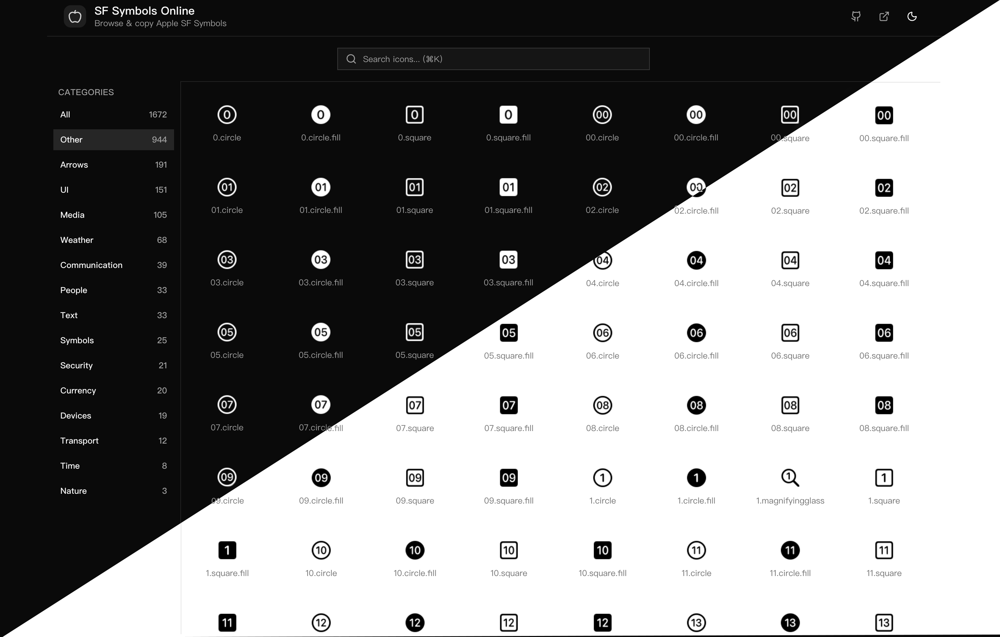

# SF Symbols Online

A beautiful online browser for Apple's SF Symbols.

**Live Demo**: <https://sf-symbols-online-web.vercel.app/>



## Features

- **1,672 SF Symbols** - Complete icon library
- **Instant Search** - Fuzzy search with `⌘K` shortcut
- **Category Filter** - Browse by semantic categories
- **One-Click Copy** - Click to copy icon name
- **Dark Mode** - Automatic + manual toggle
- **Responsive** - Desktop, tablet, mobile

## Quick Start

```bash
bun install
bun run dev:web
```

Open <http://localhost:3001>

## Acknowledgments

- Icons from [sf-symbols-online](https://github.com/andrewtavis/sf-symbols-online) by [@andrewtavis](https://github.com/andrewtavis)
- SF Symbols is a trademark of Apple Inc.

## License

MIT
